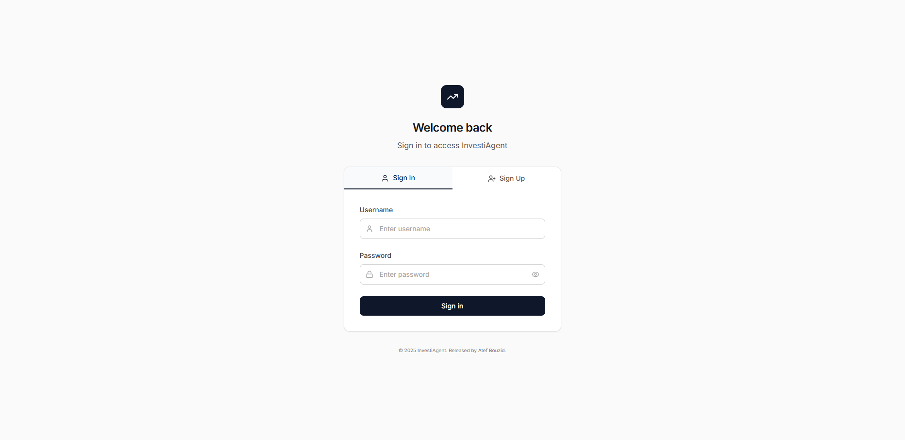
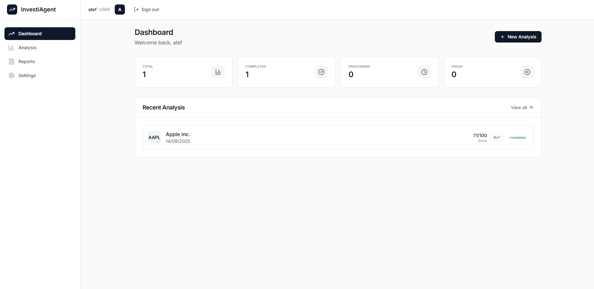
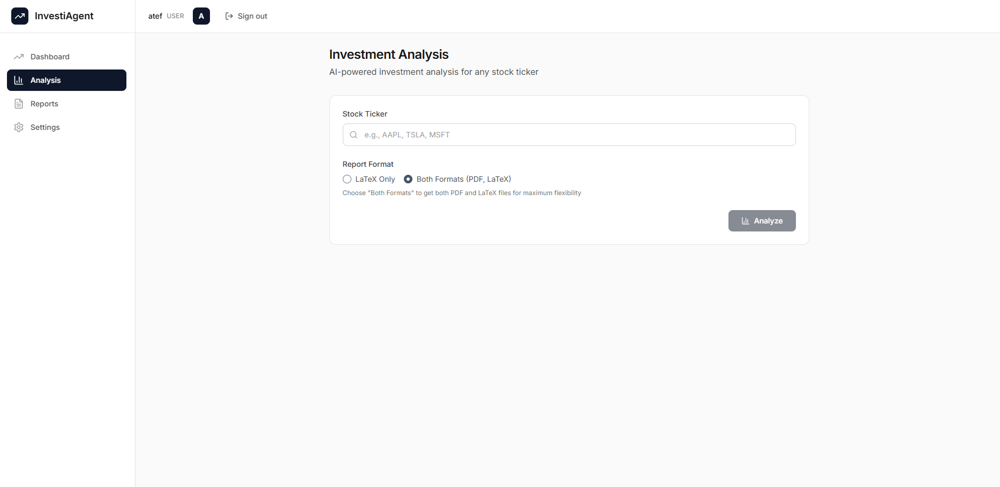
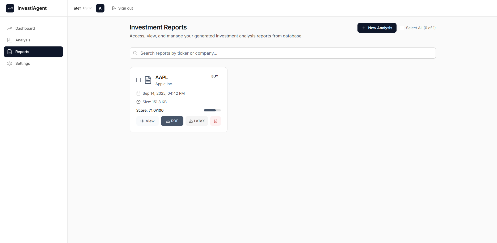
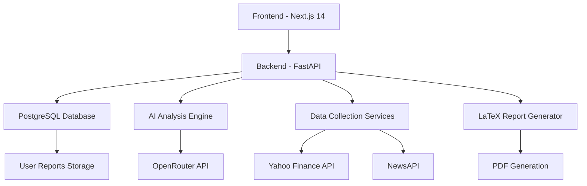

# 🚀 AI Investment Research Agent - Full Stack ML Platform

<div align="center">


**A comprehensive AI-powered investment research platform built with modern web technologies and advanced machine learning models.**

[🎥 **Watch Demo Video**](https://www.loom.com/share/33a87afb172542f9a8961691cbd01b06?sid=b7ab9995-ea60-48ee-a3d0-5f9924b803c0)

</div>

## 📋 Table of Contents

- [🎯 Overview](#-overview)
- [✨ Key Features](#-key-features)
- [🖼️ Screenshots](#️-screenshots)
- [🏗️ Architecture](#️-architecture)
- [🚀 Quick Start](#-quick-start)
- [📁 Project Structure](#-project-structure)
- [🛠️ Technologies](#️-technologies)
- [📊 API Documentation](#-api-documentation)
- [🔧 Configuration](#-configuration)
- [📈 Usage Guide](#-usage-guide)
- [🤝 Contributing](#-contributing)
- [📄 License](#-license)

## 🎯 Overview

The AI Investment Research Agent is a sophisticated full-stack platform that leverages cutting-edge artificial intelligence to provide comprehensive stock analysis and investment recommendations. Built with enterprise-grade technologies, it combines real-time data collection, advanced ML models, and professional report generation to deliver actionable investment insights.

### 🎥 Demo Video

**Watch the complete platform demonstration:**
[](https://www.loom.com/share/33a87afb172542f9a8961691cbd01b06?sid=723d96b1-51b7-47f4-a920-d886f7e64143)

## ✨ Key Features

### 🤖 **AI-Powered Analysis**
- Advanced Large Language Model integration (DeepSeek Chat)
- Real-time sentiment analysis from multiple news sources
- Comprehensive financial metrics evaluation
- Risk assessment and investment scoring

### 📊 **Professional Dashboard**
- Modern, responsive web interface built with Next.js 14
- Real-time analysis progress tracking
- Interactive data visualizations
- User-friendly navigation and controls

### 📈 **Real-time Data Collection**
- Live stock data from Yahoo Finance API
- News sentiment analysis from NewsAPI
- Historical price data and technical indicators
- Company fundamentals and financial statements

### 📄 **Automated Report Generation**
- Professional LaTeX-generated PDF reports
- Comprehensive analysis sections with charts
- Downloadable reports in multiple formats
- Database-stored reports with user isolation

### 🔐 **Secure Authentication**
- JWT-based user authentication
- Role-based access control
- Secure password validation
- User session management

### ⚡ **High-Performance Backend**
- FastAPI with async/await support
- PostgreSQL database with optimized queries
- Background task processing
- Automatic report cleanup and optimization

## 🖼️ Screenshots

### 🔐 Login Interface

*Secure user authentication with modern UI design*

### 📊 Main Dashboard

*Comprehensive dashboard with analysis history and quick actions*

### 🔍 Analysis Interface

*Real-time stock analysis with progress tracking and results*

### 📋 Reports Management

*Professional report management with PDF viewer and download options*

## 🏗️ Architecture



## 🚀 Quick Start

### Prerequisites

- **Python 3.8+** with pip
- **Node.js 16+** with npm
- **PostgreSQL 12+** (optional, SQLite fallback available)

### Option 1: One-Command Startup (Recommended)

```bash
# Clone the repository
git clone https://github.com/yourusername/ai-investment-research-platform.git
cd ai-investment-research-platform

# Start the entire platform
python start_project.py
```

This automated script will:
- ✅ Check and install all dependencies
- ✅ Set up the frontend development environment
- ✅ Start both backend and frontend servers
- ✅ Display access URLs and setup instructions

### Option 2: Manual Setup

#### Backend Setup
```bash
cd backend
pip install -r requirements.txt
python main.py
```

#### Frontend Setup
```bash
cd frontend
npm install
npm run dev
```

### Access the Application

- **🌐 Frontend**: http://localhost:3000
- **🔧 Backend API**: http://localhost:8000
- **📚 API Documentation**: http://localhost:8000/docs

## 📁 Project Structure

```
AI-Investment-Research-Agent-Full-Stack-ML-Platform/
├── 📁 backend/                          # FastAPI Backend
│   ├── 📁 app/
│   │   ├── 📁 auth/                     # Authentication module
│   │   │   └── auth.py                  # JWT authentication logic
│   │   ├── 📁 database/                 # Database utilities
│   │   │   └── database.py              # PostgreSQL operations
│   │   └── 📁 services/                 # Core business logic
│   │       ├── data_collector.py        # Stock data collection
│   │       ├── data_cleaner.py          # Data processing & cleaning
│   │       ├── llm_analysis_agent.py    # AI analysis engine
│   │       └── latex_report_generator.py # Report generation
│   ├── 📁 reports/                      # Legacy report files
│   ├── main.py                          # FastAPI application entry
│   └── requirements.txt                 # Python dependencies
├── 📁 frontend/                         # Next.js Frontend
│   ├── 📁 app/                          # App Router pages
│   │   ├── 📁 analysis/                 # Analysis interface
│   │   ├── 📁 dashboard/                # Main dashboard
│   │   ├── 📁 login/                    # Authentication pages
│   │   ├── 📁 reports/                  # Reports management
│   │   └── 📁 settings/                 # User settings
│   ├── 📁 components/                   # Reusable components
│   │   └── Layout.tsx                   # Main layout component
│   ├── 📁 contexts/                     # React contexts
│   │   └── AuthContext.tsx              # Authentication context
│   └── package.json                     # Node.js dependencies
├── 📁 database/                         # Database schema
│   └── schema.sql                       # PostgreSQL schema
├── 📁 imgs/                             # Screenshots and assets
├── docker-compose.yml                   # Docker configuration
├── start_project.py                     # One-command startup script
└── README.md                            # This file
```

## 🛠️ Technologies

### Backend Stack
- **FastAPI 0.104** - Modern, fast web framework for building APIs
- **PostgreSQL 15** - Robust relational database
- **SQLAlchemy** - Python SQL toolkit and ORM
- **JWT** - JSON Web Token authentication
- **yfinance** - Yahoo Finance data collection
- **Transformers** - Hugging Face AI models
- **LaTeX** - Professional document generation
- **OpenRouter API** - AI model access

### Frontend Stack
- **Next.js 14** - React framework with App Router
- **TypeScript 5.0** - Type-safe JavaScript
- **Tailwind CSS** - Utility-first CSS framework
- **Lucide Icons** - Beautiful icon library
- **Recharts** - Data visualization components
- **React Context** - State management

### DevOps & Tools
- **Docker** - Containerization
- **Git** - Version control
- **ESLint** - Code linting
- **Prettier** - Code formatting

## 📊 API Documentation

### Authentication Endpoints
```http
POST /auth/login          # User login
POST /auth/register       # User registration
GET  /auth/me            # Get current user info
```

### Analysis Endpoints
```http
POST /analyze            # Start stock analysis (authenticated)
POST /analyze-public     # Public analysis (for testing)
GET  /analysis/history   # Get user's analysis history
GET  /analysis/{id}      # Get specific analysis details
```

### Report Management
```http
GET    /reports/history              # List user's reports
GET    /reports/{id}/download        # Download report
GET    /reports/{id}/view            # View report inline
DELETE /reports/{id}                 # Delete specific report
DELETE /reports/cleanup              # Cleanup all user reports
```

### System Endpoints
```http
GET /                    # API status and health
GET /health             # Simple health check
GET /models             # Available AI models
```

## 🔧 Configuration

### Environment Variables

Create a `.env` file in the root directory:

```env
# Database Configuration
DB_HOST=localhost
DB_PORT=5432
DB_NAME=investment_db
DB_USER=postgres
DB_PASSWORD=your_password

# Authentication
JWT_SECRET_KEY=your-super-secret-jwt-key-change-in-production
JWT_ALGORITHM=HS256
JWT_EXPIRE_MINUTES=1440

# AI Models & APIs
OPENROUTER_API_KEY=your_openrouter_api_key_here
NEWS_API_KEY=your_news_api_key_here

# Application Settings
DEBUG=true
LOG_LEVEL=info
CORS_ORIGINS=http://localhost:3000,http://127.0.0.1:3000
```

### API Keys Setup

1. **OpenRouter API Key**: Get from [OpenRouter](https://openrouter.ai/)
2. **NewsAPI Key**: Get from [NewsAPI](https://newsapi.org/)

## 📈 Usage Guide

### 1. **User Registration & Login**
- Create a new account or login with existing credentials
- Secure JWT-based authentication
- Role-based access control

### 2. **Stock Analysis**
- Enter a stock ticker symbol (e.g., AAPL, TSLA, MSFT)
- Choose report format (PDF or LaTeX)
- Monitor real-time analysis progress
- View comprehensive results

### 3. **Report Management**
- Access your analysis history
- View reports inline with PDF viewer
- Download reports in multiple formats
- Manage storage with cleanup options

### 4. **Dashboard Features**
- Track analysis history and statistics
- Quick access to recent reports
- User settings and preferences
- System status monitoring

## 🚀 Advanced Features

### Real-time Analysis Streaming
- Server-sent events for live progress updates
- Background processing with status tracking
- Error handling and recovery mechanisms

### Database Optimization
- Automatic report cleanup (5-day retention)
- User-specific data isolation
- Efficient binary storage for reports
- Background maintenance tasks

### Security Features
- JWT token authentication
- Password validation and hashing
- CORS protection
- Input sanitization and validation

## 🤝 Contributing

We welcome contributions! Please follow these steps:

1. **Fork the repository**
2. **Create a feature branch**: `git checkout -b feature/amazing-feature`
3. **Commit your changes**: `git commit -m 'Add amazing feature'`
4. **Push to the branch**: `git push origin feature/amazing-feature`
5. **Open a Pull Request**

### Development Guidelines

- Follow TypeScript best practices
- Write comprehensive tests
- Update documentation
- Follow the existing code style
- Ensure all tests pass

## 📄 License

This project is licensed under the MIT License - see the [LICENSE](LICENSE) file for details.

## 🙏 Acknowledgments

- **OpenRouter** for AI model access
- **Yahoo Finance** for financial data
- **NewsAPI** for news sentiment analysis
- **FastAPI** and **Next.js** communities
- **Tailwind CSS** for beautiful styling

---

<div align="center">

**Built with ❤️ for AI-powered financial analysis**

[](https://github.com/yourusername/ai-investment-research-platform)
[](https://github.com/yourusername/ai-investment-research-platform)

</div>